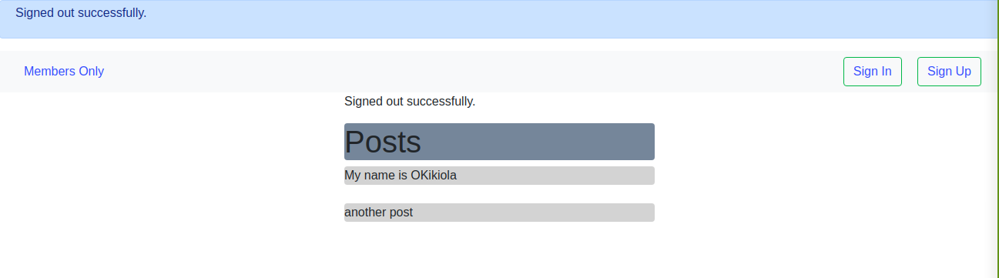

# MEMBERS ONLY
This is a mini project which emphasizes on building user authentication with devise, a signed in user can basically perform CRUD (create, read,update,delete) operations on their created posts while a visitor to the page can only view the posts already created by the signed in user without having the ability to perform any operations on such post.

## Built With
- Ruby
- Ruby on Rails

## Getting Started
To get a local copy up and running follow these simple example steps:
 
### Prerequisite
- Install rails or checkout the <a href="https://guides.rubyonrails.org/getting_started.html">Rails Guide</a> on how to setup the rails environment
- Code editor
- Git and Github

## Usage
- Clone the project to your local machine
- Run the rails server with the command rails s in your terminal
- To view the webpage, start the local machine on the browser using:
http://localhost:3000/users

## Authors
- Okikiola Apelehin
- Prajwal Thapa

👤 **Author1**

- Github: [@okikiola11](https://github.com/okikiola11)
- Twitter: [@Kikiolla3](https://twitter.com/Kikiolla3)
- Linkedin: [@okikiola-apelehin](https://www.linkedin.com/in/okikiola-apelehin-459008122/)

👤 **Author2**
- LinkedIn: [Prazwalthapa](www.linkedin.com/in/prazwal-thapa/) 
- GitHub: [@praz99](https://github.com/praz99)
- E-mail: t.prazwal@gmail.com 

## 🤝 Contributing

Contributions, issues and feature requests are welcome!

Feel free to check the [issues page](https://github.com/okikiola11/Members_only/issues).

## Show your support

Give a ⭐️ if you like this project!

## Acknowledgments

- Google

## 📝 License

This project is [MIT](lic.url) licensed.